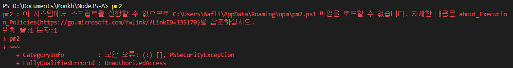

# Powershell 관리자 권한

- Powershell에서 pm2를 실행하는데 아래와 같은 에러가 발생함.
    - 
- Powershell의 실행정책의 문제로 실행이 되지 않음
    - LocalMachine의 Execution Policy를 RemoteSigned로 변경하여 해결

- [참조 블로그](https://m.blog.naver.com/10hsb04/221730667623)
- [MS Doc](https://docs.microsoft.com/en-us/powershell/module/microsoft.powershell.security/get-executionpolicy?view=powershell-7)